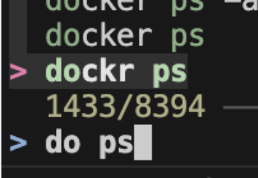

## 課題

terminal 上のコマンドは実行履歴が残っており、それを shell の history と呼ぶのですが、そんな history は情報の山となってます。


自分は主に『**過去のコマンドを history から呼び出し fzf で曖昧に検索する**』みたいな用途で使っているのですが、その際に『typo などで絶対に成功しないコマンドが永遠に history に残り、レコメンドに表示されてしまう』というという問題がありました。

  
（過去の typo である dockr ps は不要すぎる！）

そこで『**zsh の precmd（プロンプトを表示する直前に呼ばれる）を利用し、終了コードが 0 より大きかったら履歴から削除する**』というスクリプトを作成したので共有です。


## 環境

``` sh
$ zsh --version
zsh 5.8.1 (x86_64-apple-darwin22.0)

# 今回のスクリプトでは omz_history への alias になってても大丈夫なはず。
$ which history
history: shell built-in command
```

## 結論

`.zshrc` に以下の設定を書くことで対応したつもりです。

- 失敗直後、HISTFILE の最終行だけ消す
  - 排他制御とか知らんけど
- history は常に HISTFILE を指してるわけではない
  - HISTFILE をいじる前にシェルに持ってる情報を全部 HISTFILE に書き出す
  - fzf での検索前に HISTFILE と history コマンドの同期をとる
- ファイルの内容・プロセスの状況等で**たまたま失敗したものは削除したくない**
  - HISTFILE に残す内容に重複を許し、失敗時は失敗したもの（最後の1行）のみを削除することで対応
    - 1度でも成功したら残る

``` sh
# history of zsh
setopt HIST_EXPIRE_DUPS_FIRST
setopt HIST_IGNORE_DUPS
# NOT set this flag in order to keep past successful commands (and can be searched).
# setopt HIST_IGNORE_ALL_DUPS
setopt HIST_IGNORE_SPACE
setopt HIST_FIND_NO_DUPS
setopt HIST_SAVE_NO_DUPS
setopt HIST_REDUCE_BLANKS
setopt EXTENDED_HISTORY
setopt HIST_NO_STORE
setopt SHARE_HISTORY

HISTFILE="$HOME/.zsh_history"
HISTSIZE=50000
SAVEHIST=10000

HISTORY_IGNORE="(vz|sz|cz|ls|cd|pwd|exit|cd ..|last_command=*|grep -vxF*|sed '$d' $HISTFILE*)"

precmd() {
    if [[ $? != 0 ]]; then
        # Write to $HISTFILE immediatlly.
        fc -W

        # Delete from $HISTFILE when the last command fails.
        # version1
        # last_command="$(tail -n1 $HISTFILE)";
        # grep -vxF "$last_command" $HISTFILE > temp_histfile && mv temp_histfile $HISTFILE
        # version2
        sed '$d' $HISTFILE > temp_histfile && mv temp_histfile $HISTFILE

        # NOT updating the history command here in order to load the previous command using the up arrow key.
        # fc -R $HISTFILE
    fi
}

select-history() {
    # Load from $HISTFILE (update history command).
    fc -R $HISTFILE

    # Write to command-line.
    # BUFFER="$(HISTCONTROL=ignoredups; history -n -r 1 | fzf --query "$BUFFER")"
    BUFFER="$(history | awk '{for(i=2;i<=NF;++i) printf "%s ", $i; printf "\n"}' | sort | uniq | fzf --query "$BUFFER")"

    # Move cursor to the right end of the command-line.
    CURSOR="$#BUFFER"
}
# Assign Ctrl + R.
zle -N select-history
bindkey '^r' select-history
```
