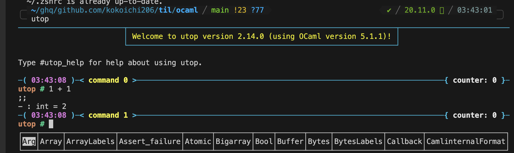

## anything

- [Expressions and Definitinos](https://ocaml.org/docs/tour-of-ocaml#expressions-and-definitions)
  - everything has a value
    - every value has a type
  - functions are values too
- `.ml` file
  - stands for 'Meta Language.'
  - Meta Language (ML) is an ancestor of OCaml.
- ecosystems
  - https://ocaml.org/docs/installing-ocaml#install-platform-tools
  - dune:
    - a fast and full-featured build system



- modules
  - https://ocaml.org/docs/modules
- let 式
  - 式の計算中に、一時的に名前をつけられる

## init

I like this shell interactive mode...

``` sh
$ opam init

  Otherwise, every time you want to access your opam installation, you will
  need to run:

    eval $(opam env)

  You can always re-run this setup with 'opam init' later.

Do you want opam to configure zsh?
> 1. Yes, update ~/.zshrc
  2. Yes, but don't setup any hooks. You'll have to run eval $(opam env) whenever you change
     your current 'opam switch'
  3. Select a different shell
  4. Specify another config file to update instead
  5. No, I'll remember to run eval $(opam env) when I need opam

[1/2/3/4/5] 1

User configuration:
  Updating ~/.zshrc.
  Added 9 lines after line 277 in ~/.zshrc.
```

Initialize project

``` sh
opam exec -- dune init proj hello
```

## run

``` sh
opam exec -- dune build
opam exec -- dune exec hello


opam exec -- dune build -w
opam exec -- dune exec hello -w
```

## package

``` sh
opam install sexplib
```

- Lwt:
  - Lightweight Thread
  - 非同期 I/O 

## pipiline

- https://cs3110.github.io/textbook/chapters/hop/pipelining.html
