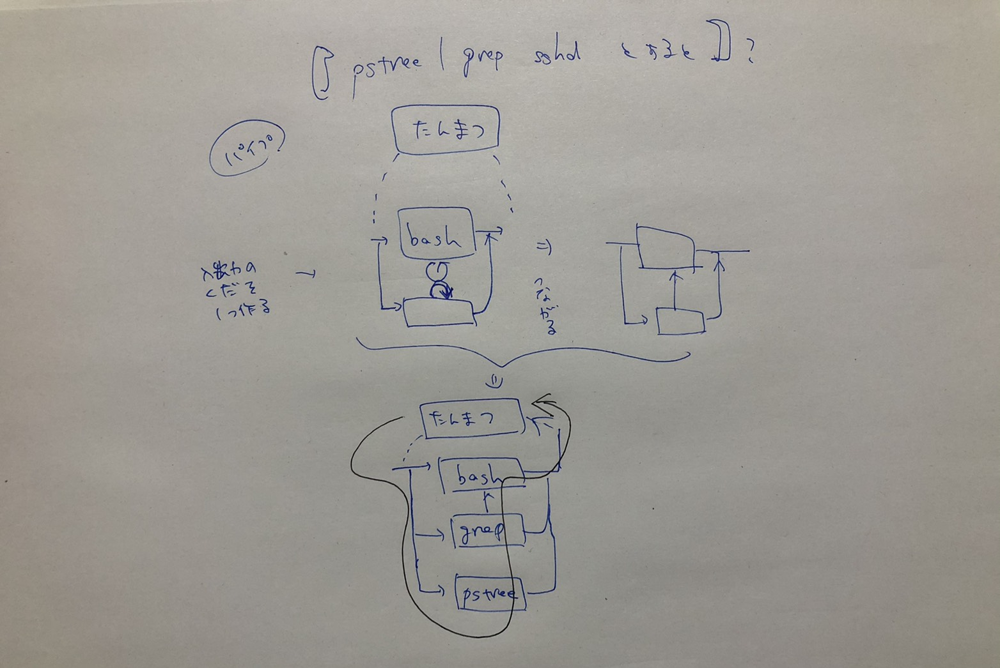
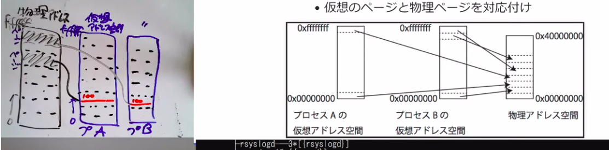

## 開発における手っ取り早さの実現  
プラットフォームの存在  
- ハード：PC、Raspberry Pi、Arduino  
- ソフト：UNIX、Linux  
- サービス：GitHub  
- ロボット：TurtleBot、Cart-mini、HSR、  
  
## Raspberry Pi  
シングルボードコンピュータ  
性能というよりもプラットフォームとして非常に優秀  
イギリスで開発された教育用のシングルボードコンピュータ  
安価でハードの制御ができるような目的、2009-  
2016に1000万台販売  
  

## Install Ubuntu on Raspberry Pi  
ubuntu Raspberry pi と Etcherを利用  
  
## ipアドレス  
```  
ip a  
```  
192.168.3.7 がラズパイのIPアドレス  
他のPCからアクセスする方法  
```  
ssh ubuntu@192.168.3.7  
=> pw: hogehoge  
```  
画面真っ暗になっても、メモリ->SSD間で書き込みをしてるため、すぐは切らない！！  
通信できてるかチェック  
```  
ping 192.168.3.7  
```  
  
## GPIOピン  
40ピン存在する。  
General purpose input output  
  
## PC spec  
```  
cat /proc/cpuinfo | less  
-> j,k  
free  
ls /dev/mmcblk0*  
uname  
cat /etc/lsb-release  
ps  
ps aux (全プロセス)（[]は実はプロセスじゃない）  
top  
pstree  
pstree -a  
```  
  
## Linuxの世界  
2大重要事項  
- データは全て「ファイル」で保存される  
- プログラムは「プロセス」単位で動く  
その他  
- ファイルもプロセスも木構造で管理されている  
  
### command  
```  
ls /bin/ | grep ls  
echo unko | rev | grep -o .  
find aaa  
grep ubuntu /etc/passwd  
find /  
find / | less  
find / | grep passwd  
'/passwd$'  
cat /etc/services | grep '[^0-9]80/'  
cat /etc/services | grep -C1 '[^0-9]80/'  
```  
通信系  
ping、通信先にパケットが届くか確認する  
```  
ping www.yahoo.co.jp  
ping 8.8.8.8    (google)  
ip addr show  
traceroute 8.8.8.8  
```  
マシン間でファイルをコピー！  
srp,rsync（バックアップ）  
```  
scp record_weight.sh ubuntu@192.168.3.7:~/  
rsync -av ./scraping/ ubuntu@192.168.3.7  
  
```  
  
### apt  
APT, Advanced Packaging Tool  
  
  
***  
  
## Git  
バージョン管理システム  
Linus Torvalds が作成  
- Linusさんぶちぎれがち。  
- 有料化にキレて2週間でGit作った。  
  
初期設定  
```  
git config --global user.name "mi"  
git config --global user.email "tt.300607@gmail.com"  
git config --global core.editor vim  
cat .gitconfig  
```  
  
## GitHub  
Gitを利用したサービス  
「リポジトリ」のホスティングと公開、コミュニケーション  
```  
git clone https://github.com/kokoichi206/robot_system.git  
git add -A  
git status  
git commit -m "Add a note"  
git push  
```   
### ブランチ  
第3回の授業  
- ディレクトリの中の状態を分岐したもの  
```  
git branch  
git checkout -b dev  
git checkout main  
```  
うまくいったブランチをmainにしたい  
```  
git merge dev  
```  
  
ローカルを最新のgitにしたい  
```  
git pull  
```  
  
### コミットログ  
git commit  
->  
1行目に変更点を動詞で  
3行目に理由を  
  
### GitHub Pages  
- [公開のための参考サイト](https://qiita.com/tonkotsuboy_com/items/f98667b89228b98bc096)  
- [一例](https://kokoichi206.github.io/robot_system/)  
  
### 他の用語  
- フォーク  
    - 他人のリポジトリを自分のところに持って来る  
- プルリクエスト  
    - リポジトリの持ち主に修正したものを取り組んでもらう  
- コンフリクト（push-rejected-pull-solve conflict でOK？）  
    - git push は rejectedされる  
    - git pull すると複合されたファイルが生成される  
- 前のバージョンに戻りたい！  
    - git checkout 7cbb04c  
  
  
-------  
## Linux  
### OS  
- ハードウェアの複雑さを隠すためのソフトウェア階層  
    - ハードウェアをイジる人間には邪魔かもしれない  
  
- 仕事  
    - 抽象化：機械の世界から情報処理の世界へ  
    - 資源（リソース）管理  
        - 次々にくる「計算機（とその周辺機器）を使いたいという要求」をいかに捌くか  
  
### Linux/Unix  
  
#### なんでもファイルである  
特殊な（？）ファイル  
- 乱数発生器 /dev/random  
- ゴミ捨て場 /dev/null  
- ひたすら0x00を吐く /dev/zero  
    - ハードディスクの空部分に0を書き込んで圧縮率高める  
    - 安全に消去する  
  
#### プロセス  
- OSがある = 複数のプログラムが実行可能  
    - OSなしのマイコン制御 ＝ 1度に1つのプログラムだけ実行  
  
#### Unix  
- オープンソースの走り  
    - 当時AT&Tはコンピュータで商売できない  
    - そこでコードを配布  
- 企業、研究機関、教育機関に広まる  
    - バグのレポートや修正  
    - 使えるソフトの増加  
  
#### Unix 以後  
- 1984年AT&T商売解禁  
    - 「Unix戦争」が始まる  
- 余波：配布されたUnixから様々な亜種が誕生  
    - Unix 系 OSと呼ばれるもの  
    - ソースコードの流用  
    - 機能 の再現  
  
#### [Unix 系OS](https://ja.wikipedia.org/wiki/%E3%83%95%E3%82%A1%E3%82%A4%E3%83%AB:Unix_history-simple.svg)  
- Unix直系。大雑把にSystem V 系とBSD系  
- MINIX,Linux: Unixのコードを含まないが動作はUnix  
  
#### Linux  
- ヘルシキンキ大学時代、引きこもって開発  
- メーリングリストで助言、協力を得ながらゼロから開発  
- バザール方式  
    - [「伽藍（がらん）とバザール」](https://ja.wikipedia.org/wiki/%E4%BC%BD%E8%97%8D%E3%81%A8%E3%83%90%E3%82%B6%E3%83%BC%E3%83%AB)  
- 広まった理由  
    - ゼロから開発したことで制約が少ない  
    - 協力者が多い  
        - 上からしゃしゃり出てくる人（老害）がいないと成功する（メーリングリストがよかった）  
    - タイミング（PCの普及、Microsoftの影響、ライセンスの問題）  
  
#### Linuxの構成  
```  
ls /boot/  
```  
- Linuxの構成  
    - Linuxカーネル（OS本体）  
    - 付属のソフトウェア  
  
- 三大系統  
    - Red Hat 系  
        - ビジネス用途でシェア  
    - slackware 系  
    - debian 系  
        - Ubuntu,Raspbian  
  
- ソフトウェアの亜種の発生は技術そのものよりも社会的な理由から  
    - 著作権やライセンスに詳しくないと、このへんは理解不可能  
  
<span style="font-size: 150%; color: red; ">何を使って世に何をするのか、社会的な視点を</span>  
  
------  
  
## プロセス  
- プログラム実行の一単位  
    - プロセスID、ユーザ、親プロセス  
- 普段はps(1)やtop(1)で調査  
    - CPUやメモリ使用料、ゴミプロセスがないか調査  
  
### ps  
- $ ps aux  
    - VSZ: 仮想メモリのサイズ, RSS: （実際に）使用している物理メモリ量, STAT: プロセスの状態, START: 起動した時間, TIME: 使ったCPU時間,   
    - STATの意味  
        - R: Run, S: Sleep, D: Disk Sleep, T: Stopped, Z: Zombie, +: forground, <: high priority, s: session leader  
```  
ps aux | head  
ps aux | awk '$7!="?"'  
ps aux | awk '$8~/+/'  
```  
  
- $ top -c  
    - PR: 優先度, NI: nice値, VIRT: 仮想メモリ使用量, RES: 物理メモリ使用量, SHR: 共有メモリ使用量, S: プロセスの状態,   
  
### カーネルからみたプロセス  
- リソースを割り当てるー単位  
    - 番号を付けて管理  
- プロセスに対する仕事  
    - 生成と消去（メモリの割り当て）  
    - CPUの利用時間の管理（タイムシェアリング）  
    - プログラムが自身のプロセス外のメモリを参照しないよう保護  
        - 仮想アドレス空間  
```  
$ pstree  
```  
  
### forkとプロセスの親子関係  
- fork: あるプロセスがふたつに分裂する仕組み  
    - あるプロセスがforkすると、プロセス番号を除いて全く同じプロセスがふたつ同時に走るようになる  
- fork後のプロセス番号  
    - 一方は元のプロセス番号（親）  
    - もう一方は新たなプロセス番号をもらう（子）  
  
チェックするプログラム、fork_sample.c  
forkによるプロセスの分裂を確認できる。  
```  
./a.out  
ps  
```  
  
### PC止まらせるコマンド  
```  
:(){:|:&;};:  
```  
:で関数を作って、それをパイプで2つ処理して、&でバックグラウンド処理におとす。さらに最後に:の関数を実行すると、関数呼び出しが倍々で増えて、プロセスが増えまくってフリーズする  
  
### exec  
システムコール  
- プロセスの中身が他のプログラムに変わる仕組み  
    - 次のプログラムはexec sleep 100の瞬間にsleepに化ける  
```  
#!/bin/bash  
  
echo bashです  
sleep 10  
exec sleep 100	# このプロセス自体がsleepになる  
echo これは実行されない:  
```  
exec の前後で psをみる  
  
### シェルがコマンドを実行できる仕組み  
[ここの40分くらい](https://www.youtube.com/watch?v=twBoOez02w0&list=PLbUh9y6MXvjdIB5A9uhrZVrhAaXc61Pzz&index=8)。すごい参考になる。  
- forkとexecを組み合わせる  
    1. シェル自体がforkする  
    2. このプロセスがexecを実行してコマンドに化ける  
- 何が便利か？  
    - コマンドの入出力が端末に出てくる  
        - 端末の入出力の口がforkでコピーされて共有されている。  
    - 環境が引き継がれる  
        - シェルが日本語環境だとコマンドも日本語環境で動く  
- 考慮しておくべき点  
    - コマンドを立ち上げるたびにシェルがコピーされる  
  
### forkとパイプ  
- シェルが自分に入出力する口を作ってforkするという処理を繰り返していく  
    - コマンドが数珠つなぎに  
  
  
  
### プロセスとメモリ  
- うロセスは基本的に他のプロセスが使っているメモリの中身をみることができない  
    - みることができたら事故  
- プロセス間でメモリが見えないようにする仕組み: 仮想記憶  
  
### 仮想記憶（ページング方式）  
- アドレス空間を2種類用意  
    - 物理アドレス空間（DRAMやその他を直接さす）  
    - 仮想アドレス空間（プロセスごとに準備）  
- アドレス空間を「ページ」に分割  
- 仮想のページと物理ページを対応付け  
  
  
  
### 仮想記憶で可能となること  
- fork後も参照しているアドレスが変わらない  
- 別のプロセスのメモリ番地が見えない  
- lazyな物理メモリ割り当て  
    - プログラムが割り当てのないページの番地にアクセスした時に、物理メモリのページを割り当て  
- スワップ  
    - メモリが不足時にページ上のデータをストレージ上のページに追い出せる（スワップアウト）  
- キャッシュの管理が簡単に  
    - プロセスが使用していない物理メモリのページに書き込みしたファイルのデータを記憶  
    - キャッシュが有効だとHDDの読み書き回数を減らすことができる  
    - 書き込みも、一旦キャッシュで行われて、busyじゃないときにこっそり書き込まれる  
    - このシステムのために、メモリはとにかく沢山積むのがよい笑  
  
### jobs  
```  
sleep 1000 -> ctrl + Z  
sleep &  
jobs  
fg 2  
ps  
kill ..  
```  
  
### シグナル  
- プロセス間通信の一種  
- あるプロセスから他のプロセスへの「合図」  
- シグナルの一覧  
    - $ kill -l  
- killコマンドで送ることができる  
    - $ kill -KILL 12345 #SIGKILLをPID12345に  
    - $ kill 12345 #SIGTERMをPID12345に  
    - $ kill -INT 12345  
  
### 主なシグナル  
- SIGHUP（1番）  
    - HUP: ハングアップ（電話の切断）  
    - 使われ方  
        - 端末が切れた時に関連するプロセスを止める  
- SIGINT（2番）  
    - INT: interrupt（割り込み）  
    - 使われ方  
        - 端末でCtrl+cを押したときに端末からセッショングループのフォアグラウンドプロセスに送られる  
  
- SIGKILL（9番）  
    - プロセスを強制終了するときに使われる  
    - プログラム側で後始末できない  
    - 後始末はカーネルに任せる  
- SIGSEGV（11番）  
    - メモリのセグメンテーションフォルト  
- SIGPIPE（13番）  
    - 読み書きしていたパイプの切断  
        - $ seq 1000 | head  
- SIGTERM（15番）  
    - 終わってくれてというシグナル。プログラムは速やかに終わらないといけない。  
  
  
### 終了ステータス  
- プロセスが終わる時に親に返す番号  
    - C言語野C++でプログラミングするときにreturn 0 とかexit(0)書いてあるアレ  
    - echo $? あるいは echo ${PIPESTATUS[@]} で確認  
    - デカい数字の終了ステータスは、SIGなんとかの番号にある数字（128）を足したもの  
  
  
## やりたいこと  
- /etc/vim をいじる  
- vimtutor  
- markdown + reveal.js でスライドを作る  
- gitのテストサイト  
  
## 疑問点  
- ファイルのキャッシュってオンラインでも起こる？  
