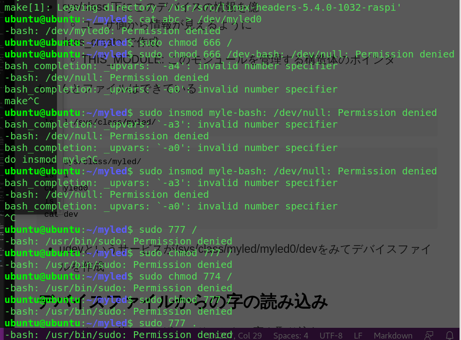
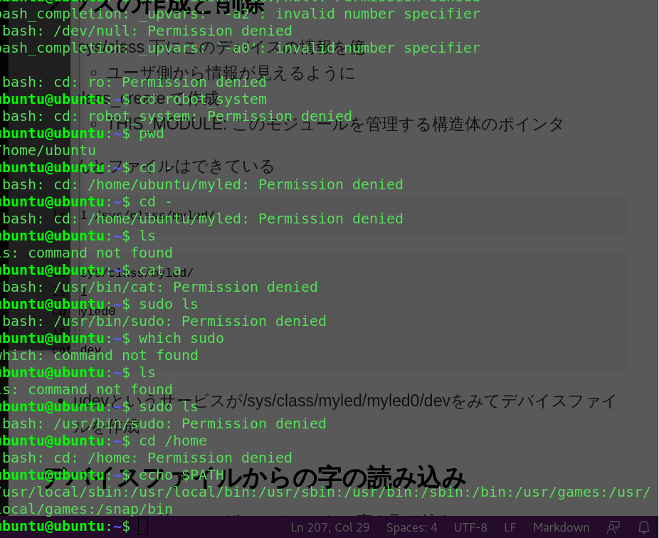

## vim 備忘録
- カーソル位置から行末まで削除: D


## sudo chmod 666 /
間違って全てのファイルの権限を666にしちゃった！



ubuntuの再インストール！
1回sshの設定（同じIPアドレスに対する）を忘れる必要がある[らしい](https://qiita.com/hnw/items/0eeee62ce403b8d6a23c)

```
ssh-keygen -R 192.168.3.7
```

## markdownのファイルに、改行の前に半角スペース2ついれるshellScript
[参考](https://qiita.com/hirohiro77/items/7fe2f68781c41777e507)（sedでスペース置換を探してたら見つけた）
> #よく間違うのが's/\n/\r\n/'では置換出来ないので注意
sed -i -e 's/$/\r/' source.txt

実際のコード
```markdownSpace.sh
#/bin/bash

# echo $1
fileName=`echo $1 | sed 's/\.[^\.]*$//'`
# echo $fileName
# cat $1 | tr '\n' '  \n' > ${fileName}_revised.md
sed 's/$/  /g' $1 > ${fileName}_rev.md
```

- $（行末）を\r（CR）で変換しているのに、その結果が\r\n（CR＋LF）になっている点が不思議だが、これはパターンスペースのしわざである
- 「sedは読み込んだ行の行末にある改行を削除してパターンスペースと呼ばれるバッファに格納したうえでテキスト処理をし、最後にパターンスペースの内容に改行をつけて出力する」


## ワンライナー
### 物理メモリ使用量が多い順に表示
```
ps aux | sort -n -k 6 | tail -n 10
```

### ひとつ前のディレクトリに戻る
```
cd -
```

### CPU使用率が高いプロセスをみつける
```
vmstat 1 | awk '{print strftime("%y/%m/%d %H:%M:%S"), $0}'
```

### ヘッダーとフッターを除外して表示
```
cat ファイル名 | sed -e '$d' | awk 'NR > 1 {print}'
```

### ファイルをからにする
```
cat /dev/null > sample.txt
```

### 拡張子を一括変更
```
for filename in *.txt; do mv $filename ${filename%.txt}.txt.old; done
```

### パスワードのランダム生成
```
head /dev/urandom | tr -dc A-Za-z0-9 | head -c 13 ; echo ''
```
tr -d
で削除、
-c, complement
で、指定文字<span style="color: blue;">以外</span>を削除

### 連番ファイルの生成
```
touch foo_{1..30}.txt
touch {A..Z}.txt
```

### ストップウォッチ的ななにか
```
time read
```

### 指定行から指定行まで表示
```
awk 'NR==10,NR==20'
```

### 奇数/偶数行のみ表示
```
# 奇数行
$ awk 'NR%2' filename

# 偶数行
$ awk 'NR%2==0' filename
```


